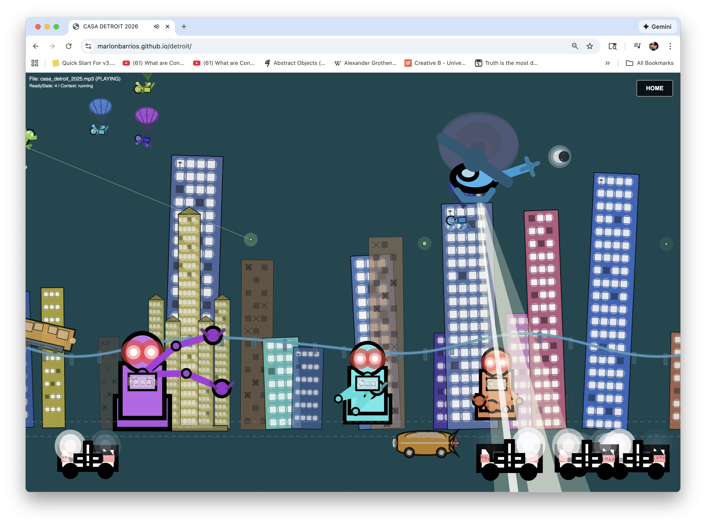
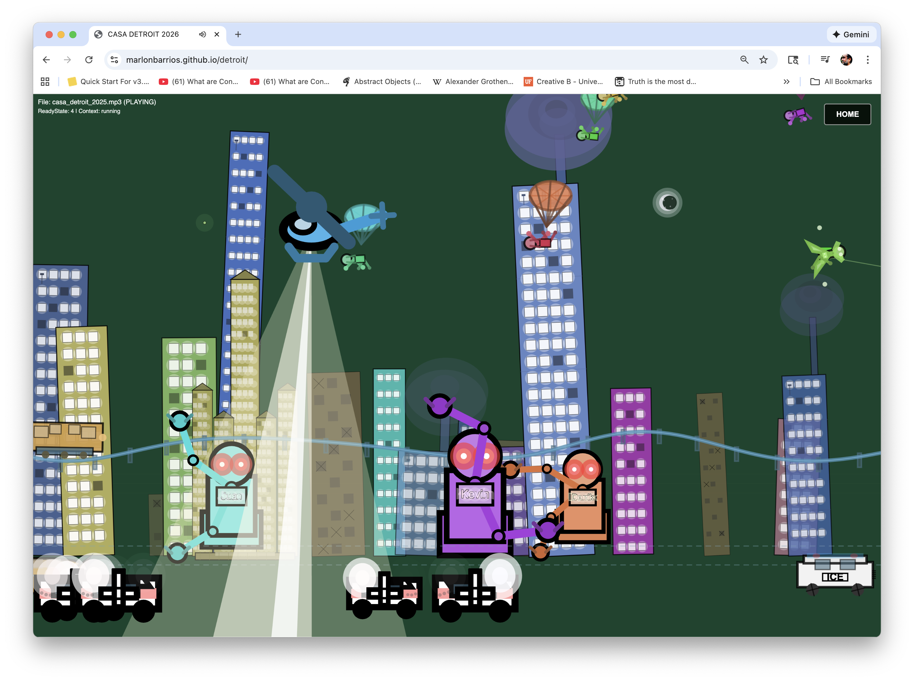
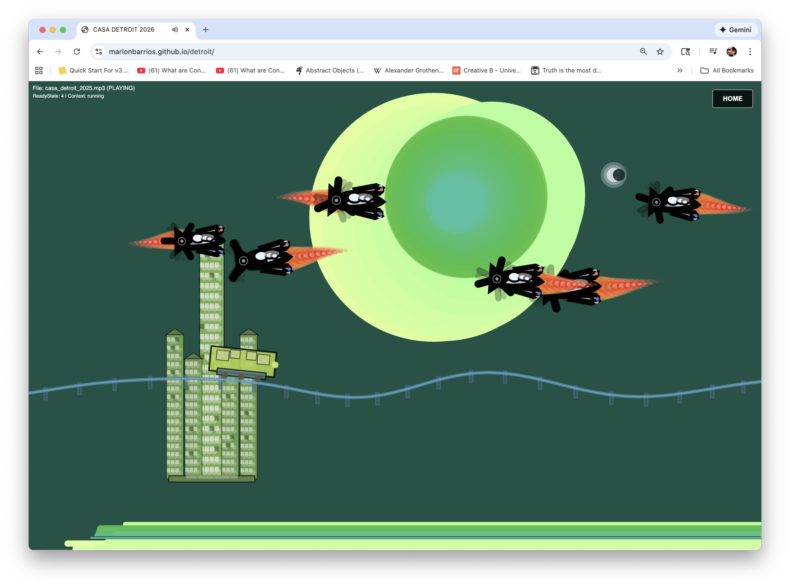
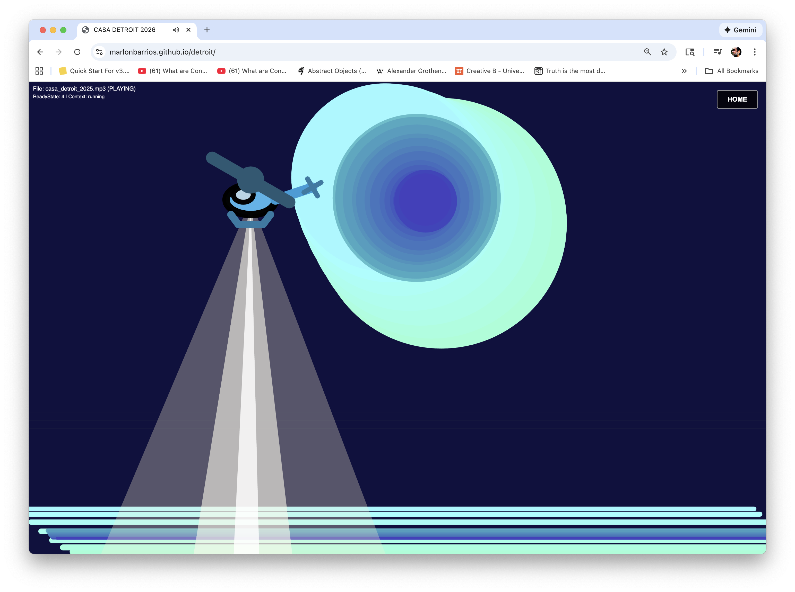
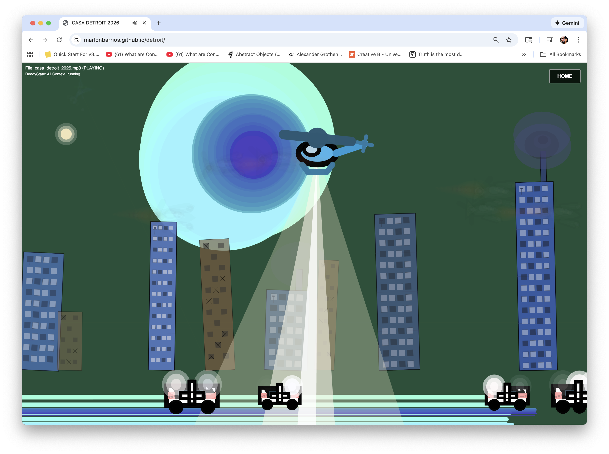
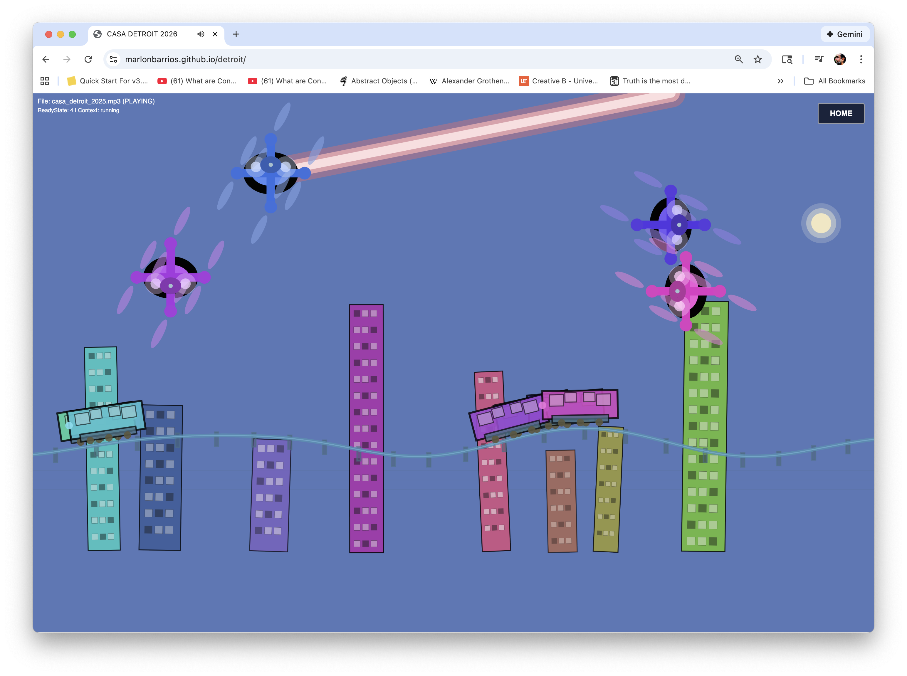
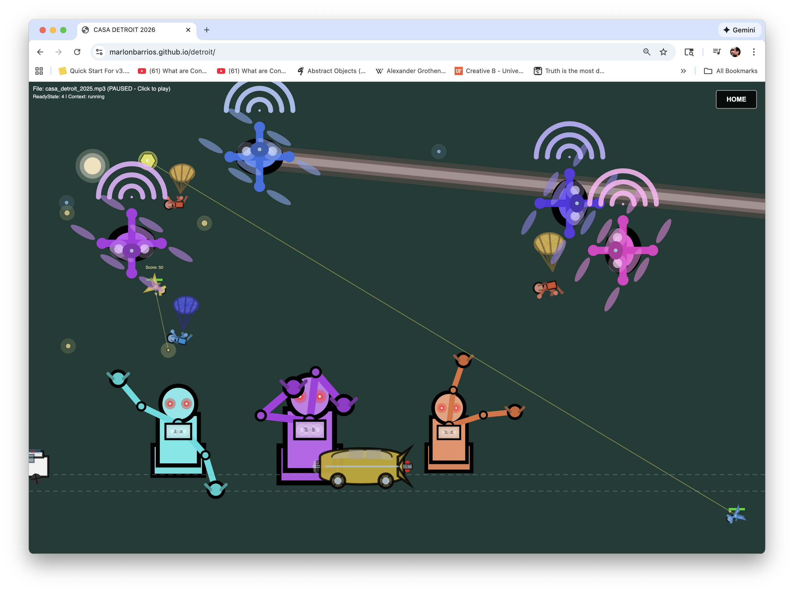

# CASA DETROIT 2026

CASA DETROIT 2026 is an immersive, interactive audio-visual experience inspired by the origins of techno music in Detroit and its profound cultural legacy. The project pays homage to the birthplace of techno while exploring speculative futures through an Afrofuturist lens, creating a mesmerizing post-industrial cityscape that reacts in real-time to the music.

This project is a creative exploration combining concept, programming, and music by Marlon Barrios Solano, with inspiration from Matt DesLauriers' work on generative art and music visualization.

## Gallery

  
  

  
  

  
  

  

## Project Description

CASA DETROIT 2026 is a generative art application that transforms audio into a living, breathing digital cityscape. Drawing inspiration from Detroit's post-industrial landscape and the speculative visions of Afrofuturism, the project imagines a future where technology, architecture, and human experience converge in dynamic harmony.

The experience features a complex state machine system that cycles through various visual configurations, each highlighting different elements of a futuristic Detroit-inspired environment. The visuals respond dynamically to audio frequencies, creating a synchronized dance between sound and image that echoes the rhythmic innovations of techno's pioneers.

The application includes multiple interactive elements such as vintage cars, pedestrians, parachutists, flying drones, helicopters, planes, robots, ambulances, monorail systems, and architectural structures. Each element reacts to different frequency bands of the audio, creating a multi-layered visual narrative that evolves with the music—reflecting both the post-industrial present and speculative futures of urban transformation.

## Cultural & Artistic Inspiration

### The Origins of Techno in Detroit

CASA DETROIT 2026 honors the legacy of techno music, born in the 1980s in Detroit, Michigan. The project draws inspiration from the "Belleville Three"—the three high school friends from Belleville, Michigan who pioneered the genre:

- **Juan Atkins** - Often called the "Originator," credited with creating the first techno tracks and coining the term "techno"
- **Derrick May** - Known for his emotional, melodic style under the alias Rhythim Is Rhythim, bringing depth and soul to the genre
- **Kevin Saunderson** - Brought more commercial appeal through his Inner City project, helping techno reach wider audiences

### Afrofuturism & Post-Industrial Speculation

The visual language of CASA DETROIT 2026 explores Afrofuturist themes—a cultural aesthetic that combines science fiction, historical fiction, fantasy, and Afrocentrism to reimagine the future through a Black cultural lens. The project speculates on:

- **Post-Industrial Transformation:** Imagining how Detroit's industrial past might evolve into new forms of urban life
- **Technological Reclamation:** Visualizing how technology might be reimagined and repurposed in speculative futures
- **Urban Rebirth:** Exploring the tension between decay and renewal, past and future, in the cityscape
- **Sonic Architecture:** Creating spaces where sound and structure merge, reflecting techno's ability to build entire worlds through rhythm and frequency

The project's imagery—from flying drones to monorail systems, from robots to Renaissance architecture—serves as a visual metaphor for these speculative futures, where the boundaries between human, machine, and environment blur in unexpected ways.

### Techno as Resistance, Innocence, and Vision

Techno emerged in 1980s Detroit not merely as a musical genre, but as a form of cultural expression that embodied multiple layers of meaning:

- **Techno as Resistance:** Born in a city grappling with deindustrialization, economic decline, and social challenges, techno became a form of sonic resistance—a way to create new worlds and possibilities through technology when material conditions seemed limited. The music represented a refusal to accept decline, instead imagining alternative futures through sound.

- **Techno as Innocence:** The early techno pioneers approached technology with a sense of wonder and innocence, exploring synthesizers and drum machines not as tools of industry but as instruments of pure creative expression. This innocence allowed them to see possibilities where others saw limitations, creating something entirely new from available technology.

- **Vision of Future and Unity:** Techno's utopian impulse envisioned a future where technology could bring people together across boundaries. The music's repetitive, hypnotic rhythms created spaces of collective experience—dance floors where differences dissolved into shared movement and sound. This vision of unity through technology remains central to techno's ethos.

### Early Video Game Aesthetics

CASA DETROIT 2026 draws visual inspiration from the nascent video game industry of the 1980s—the same era that gave birth to techno. The project incorporates:

- **Pixelated Simplicity:** The geometric, simplified forms echo early arcade and home console graphics, where technical limitations became aesthetic choices
- **Retro-Futurism:** The visual language combines 1980s visions of the future with contemporary digital aesthetics, creating a bridge between past technological imaginations and present realities
- **Interactive Narratives:** Like early video games, the project invites exploration and interaction, allowing users to discover different visual states and configurations
- **Playful Technology:** The project embraces the playful, experimental spirit of early game development, where creators were discovering what digital interactivity could be

These aesthetic choices connect techno's origins to the broader technological culture of the 1980s, when both music and games were exploring new forms of digital expression and imagining futures through limited but powerful tools.

## Features

- **Dynamic Sound Visualization:** Experience real-time audio-reactive visuals generated through p5.js with granular frequency analysis across multiple bands (sub-bass, bass, mid-range, treble, presence, and air frequencies).

- **Interactive Cityscape:** Explore a cyberpunk-inspired cityscape featuring:
  - Vintage cars navigating the streets
  - Pedestrians and parachutists
  - Flying drones, helicopters, and planes
  - Robots and architectural structures
  - Monorail systems
  - Dynamic lighting with day/night cycles

- **State Machine System:** The application cycles through predefined visual states, each showcasing different combinations of elements, creating a progressive and evolving experience.

- **Keyboard Controls:** Toggle individual elements using keyboard shortcuts (1-9, 0, q-w-e-r-t-y) for customized visual experiences.

- **Drag-and-Drop Audio:** Load your own audio files by dragging and dropping them onto the canvas.

- **Adaptive Design:** Visuals adapt to any screen size, ensuring a seamless experience across devices.

- **Demo Mode:** Automatic state cycling with progressive complexity accumulation for hands-free viewing.

## How to Use

1. Visit the live app: [CASA DETROIT 2026](https://marlonbarrios.github.io/detroit/)
2. Click anywhere on the screen to start the visualization and music.
3. Enjoy the evolving patterns of colors and shapes synchronized with the pulse of Detroit techno.
4. Press the spacebar to play/pause the audio.
5. Drag and drop audio files onto the canvas to visualize your own music.
6. Use keyboard shortcuts to toggle individual visual elements:
   - `1` - Toggle cars
   - `2` - Toggle people
   - `3` - Toggle parachutists
   - `4` - Toggle helicopters
   - `5` - Toggle monorail tracks
   - `6` - Toggle monorail cars
   - `7` - Toggle static buildings
   - `8` - Toggle Renaissance building
   - `9` - Toggle moving buildings
   - `0` - Toggle drones
   - `Q` - Toggle planes
   - `W` - Toggle ambulances
   - `E` - Toggle central circles (sun/moon)
   - `R` - Toggle robots
   - `T` - Toggle lasers
   - `Y` - Toggle smoke and explosions

## Technical Details

- **Framework:** Built with p5.js and p5.sound.js
- **Audio Analysis:** Uses Web Audio API with FFT analysis for real-time frequency detection
- **Visual Elements:** Procedurally generated geometric shapes, particles, and animated sprites
- **State Management:** Complex state machine system with fade transitions between states
- **Performance:** Optimized for smooth 60fps rendering with dynamic element management

## About the Music

The track "Monument 01" is an original composition by Michael Ramir C., designed to complement the visual experience with its deep techno rhythms and immersive soundscapes.

## About the Author

Marlon Barrios Solano is an artist and programmer with a passion for merging technology and creativity. His work spans across various domains including dance, digital arts, and sound visualization, focusing on the intersections between movement, technology, and immersive experiences.

## Live App

Play and experience CASA DETROIT 2026 here: [https://marlonbarrios.github.io/detroit/](https://marlonbarrios.github.io/detroit/)

## Tags

- #generative
- #musicviz
- #p5js
- #detroittechno
- #bellevillethree
- #afrofuturism
- #postindustrial
- #audiovisual
- #speculativefutures
- #retrogaming
- #80saesthetics
- #technoasresistance
- #sonicresistance
- #digitalunity

Feel free to explore the source code, and for any inquiries or collaborations, contact Marlon Barrios Solano directly.

**Repository:** [https://github.com/marlonbarrios/detroit](https://github.com/marlonbarrios/detroit)
